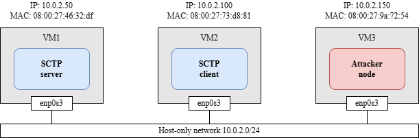
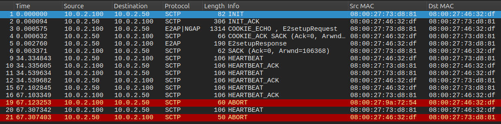

# SCTP attacks

This repository contains Python scripts that implement various attacks against the SCTP protocol using the **Scapy** library. To evaluate the effectiveness of these attacks, a testbed platform was developed utilizing components from FlexRIC, an open-source implementation of the O-RAN architecture. FlexRIC essentially comprises two components: the near-RT RIC and the E2 node.

## Scapy library

Scapy offers for low-level network packet construction and manipulation, allowing precise control over SCTP protocol header fields. The implemented scripts have the capability to intercept, analyze, and generate malicious SCTP packets, replicating the necessary parameters to spoof identities and manipulate the state of associations between components that implement SCTP.

> [!WARNING]
> In order to use the scripts provided in this repository, **it is necessary to execute them with root privileges**.


> [!TIP]
> It is recommended to install Scapy by:
> - Using the sources from the official Scapy repository,
> - Installing in local user mode,
> - Configuring the local user's environment variables to enable script execution as the root user.


## Testbed platform 

The experiments can be carried out using a testbed platform specifically designed for this purpose, as illustrated in **Figure 1**. This platform consists of three virtual machines (VMs) deployed on the VirtualBox hypervisor, all interconnected through a Host-only network with subnet address 10.0.2.0/24. 

Each virtual machine runs an Ubuntu Linux-based operating system. VM1, with IP address 10.0.2.50 and MAC address 08:00:27:46:32:df, hosts the SCTP server, which in the O-RAN architecture would be the nearRT-RIC. VM2, with IP address 10.0.2.100 and MAC 08:00:27:73:d8:81, implements the SCTP client, acting as an E2 node in O-RAN. Communication between VM1 and VM2 is established through their respective virtual network interfaces enp0s3, which enable the implementation of the E2 interface de O-RAN, responsible for message exchange between the components of each architecture. 

Finally, VM3, configured with IP 10.0.2.150 and MAC 08:00:27:9a:72:54, represents the attacker node within the testbed environment. This node hosts the Python-developed scripts that carry out different types of security attacks directed at the system. This component aims to simulate malicious behaviors in the system's control plane, in order to evaluate the robustness and possible vulnerabilities of the O-RAN against external attacks. 



__Figure 1. Testbed platform__

## Attack by ABORT packet

Running attack:

```bash
$ sudo -E python3 abort_attack.py 
```

**Figure 2** presents a Wireshark capture illustrating the execution of the ABORT attack. In frame 19, the attacker node transmits the ABORT packet to the SCTP server while spoofing the SCTP client. It can be verified that this frame is not actually sent by the SCTP client by examining the source MAC address. As a consequence, the server terminates the SCTP association. Since the client is unaware of the preceding process, it subsequently sends its usual HEARTBEAT packet (frame 20). The server detects this as an anomaly and therefore sends an ABORT packet (frame 21) to the client, insisting on terminating the SCTP association.



__Figure 2. ABORT attack__

## Attack by SHUTDOWN packet

Running attack:

```bash
$ sudo -E python3 shutdown_attack.py 
```

La **Figura 3** muestra una captura de Wireshark mostrando la ejecución del ataque SHUTDOWN. En la trama 15, el attacker node suplanta la identidad del cliente SCTP y envia una paquete SHUTDOWN en su nombre. De manera similar al ataque ABORT, se puede observar la direccion MAC source para verificar que quien envia el paquete es el attacker node. Al recibir el paquete SHUTDOWN, el servidor inicia el proceso de finalización de la asociacion SCTP enviando el paquete SHUTDOWN_ACK (trama 16). Como el cliente desconoce del proceso llevado a cabo por el attacker node, no responde al SHUTDOWN_ACK. En su lugar el atacker node responde con el paquete SHUTDOWN_COMPLETE, haciendo que el servidor de por finalizada la asociación. Mientras tanto el cliente continua con su proceso habitual de enviar paquetes HEARTBEAT (trama 21). Esto es detectado por el servidor como una anomalia y envía el paquete ABORT (trama 21) al cliente para finalizar de manera abrupta la asociación.

Figure 3 shows a Wireshark capture depicting the execution of the SHUTDOWN attack. In frame 15, the attacker node spoofs the SCTP client and sends a SHUTDOWN packet on its behalf. Similarly to the ABORT attack, the source MAC address can be inspected to verify that the packet is sent by the attacker node. Upon receiving the SHUTDOWN packet, the server initiates the SCTP association termination process by sending a SHUTDOWN_ACK packet (frame 16). Since the client is unaware of the process initiated by the attacker node, it does not respond to the SHUTDOWN_ACK. Instead, the attacker node responds with a SHUTDOWN_COMPLETE packet, causing the server to consider the association terminated. Meanwhile, the client continues its usual process of sending HEARTBEAT packets (frame 21). The server detects this as an anomaly and sends an ABORT packet (frame 21) to the client in order to abruptly terminate the association.


__Figure 3. SHUTDOWN attack__

